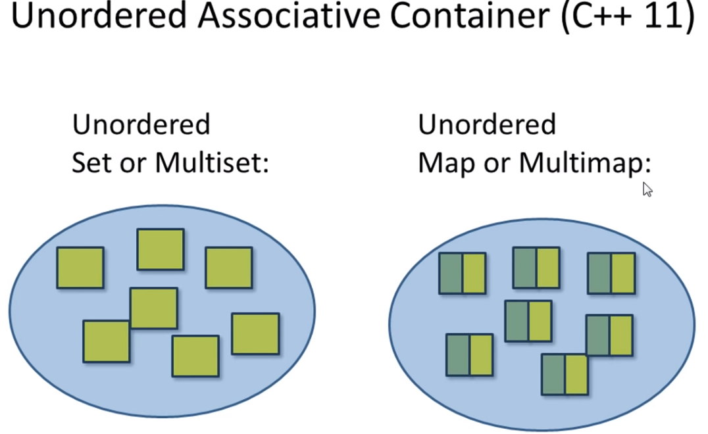

Unordered 
Set or Multiset


	
	

## Hashtable
## Array of linked list
## Hash function
## Buckets:
## Entried


Fast and effective function: 
```cpp

unordered_set<string> myset = {"red", "green", "blue"};
unordered_set<string>::const_iterator itr = myset.find("green") // O(1)

if(itr != myset.end())) \\ Importatn check
  cout << *itr << endl;
  myset.insert("yellow"); // O(1)
  
 //use with other containers
 vector<string> vec = {"purple","pink"};
 myset.insert(vec.begin(),vec.end());
 
 //Hash table specific APIs,
 cout << "load_factor = " << myset.load_factor() << endl;
 string x = "red";
 cout << x << " is in bucket # " << myset.bucket(x) << endl;
 cout << "Total bucket #" << myset.bucket_count() << endl;
 
// unordered multiset: unordered set that allows duplicated elements
// unordered map: pairs
// unordred multimap: allows dulplicated keys.

// hash collision => performance degrade
// worst case scenatio: all entries are placed in one bucket, O(1) => O(n)

// fast search and insert at any place O(1)
  // associative container takes O(log(n))

//unordered set: value cannot be changed
//unordered map: key can not be changed
```

```cpp
// Associative array

unordered_map<char, string> day
map 
```

```cpp

Container Adaptor:
1. stack:
2. queue:
3. priority queue:
```
* Array based containers: vector, deque
* Node based pointers: list, asociative containers + unordered containers.

_Array based containers invalidate pointers: (iterators, and references)_

https://www.youtube.com/watch?v=NNLvY9O7ufU
